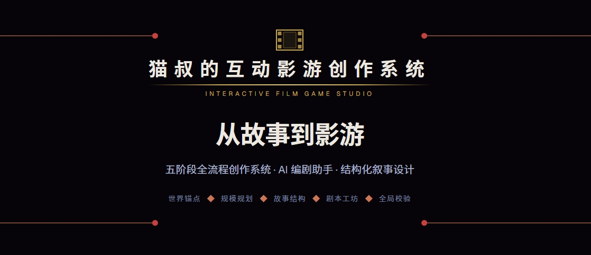
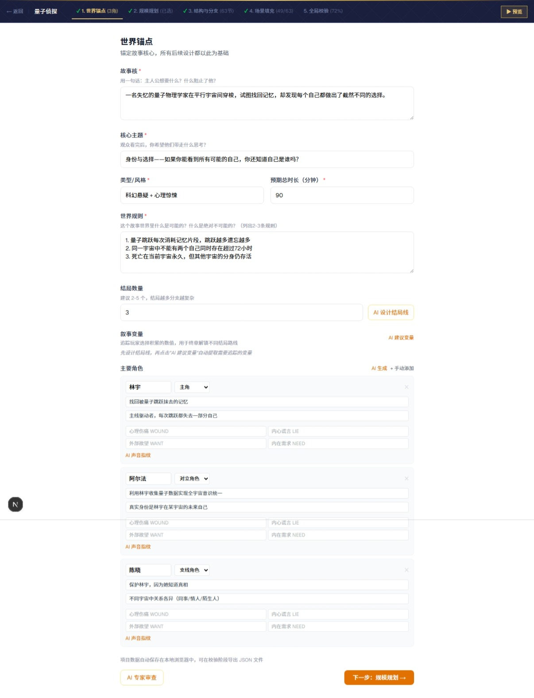
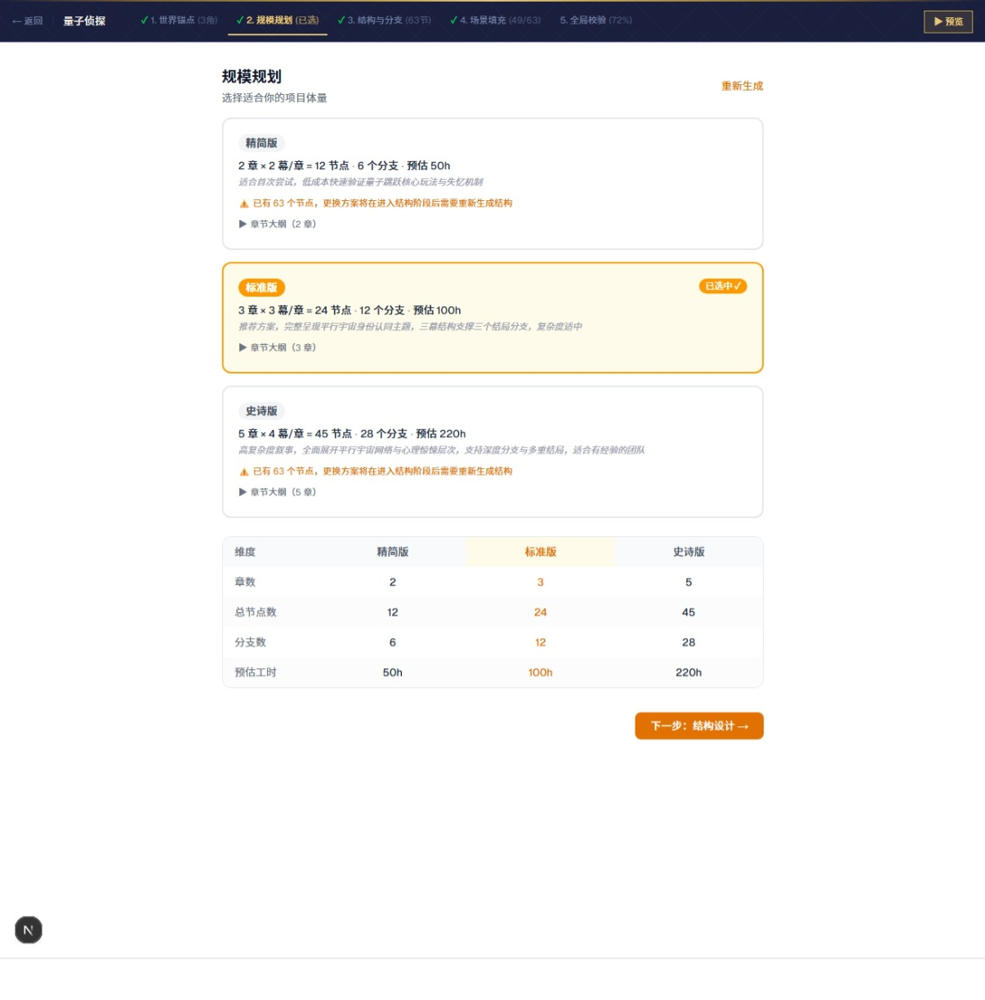
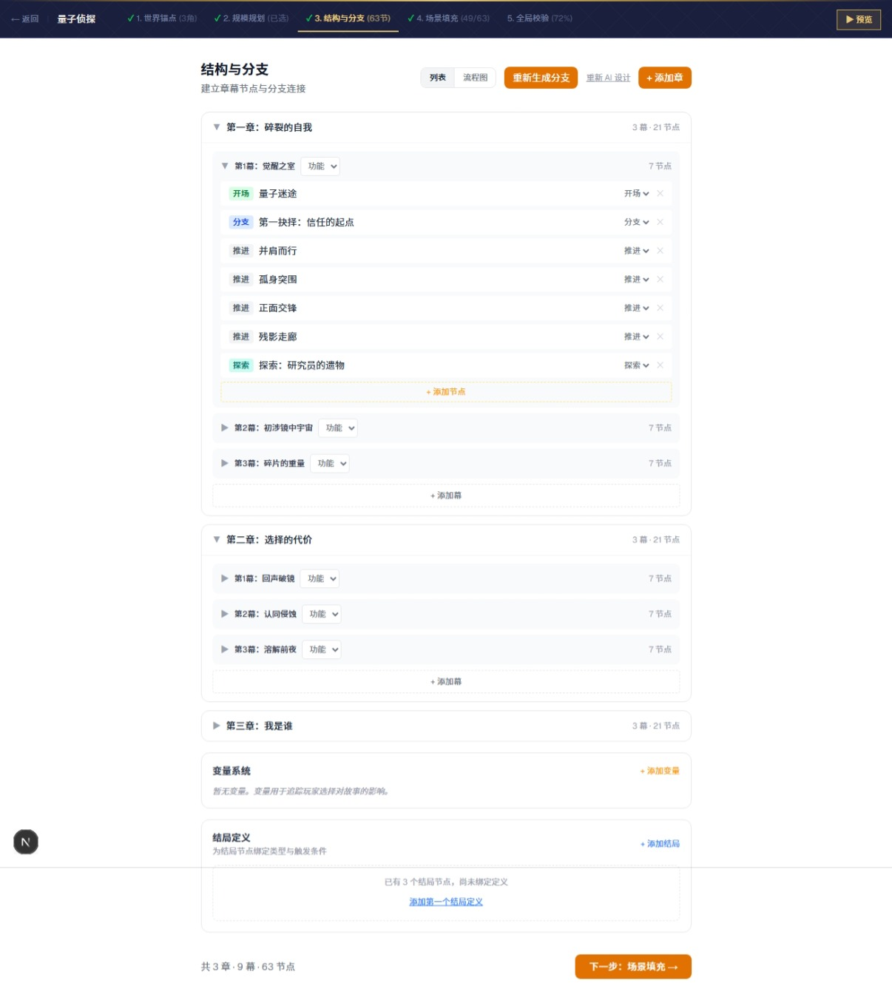
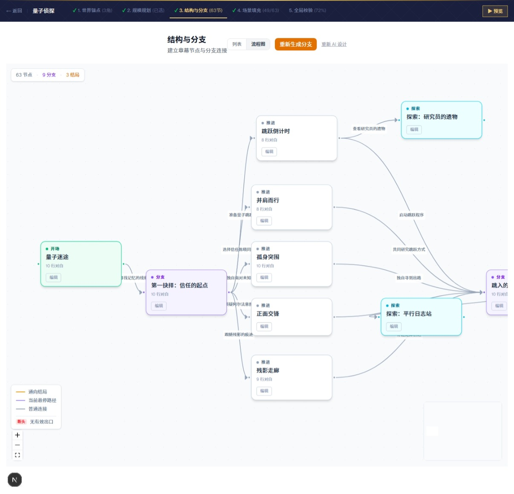
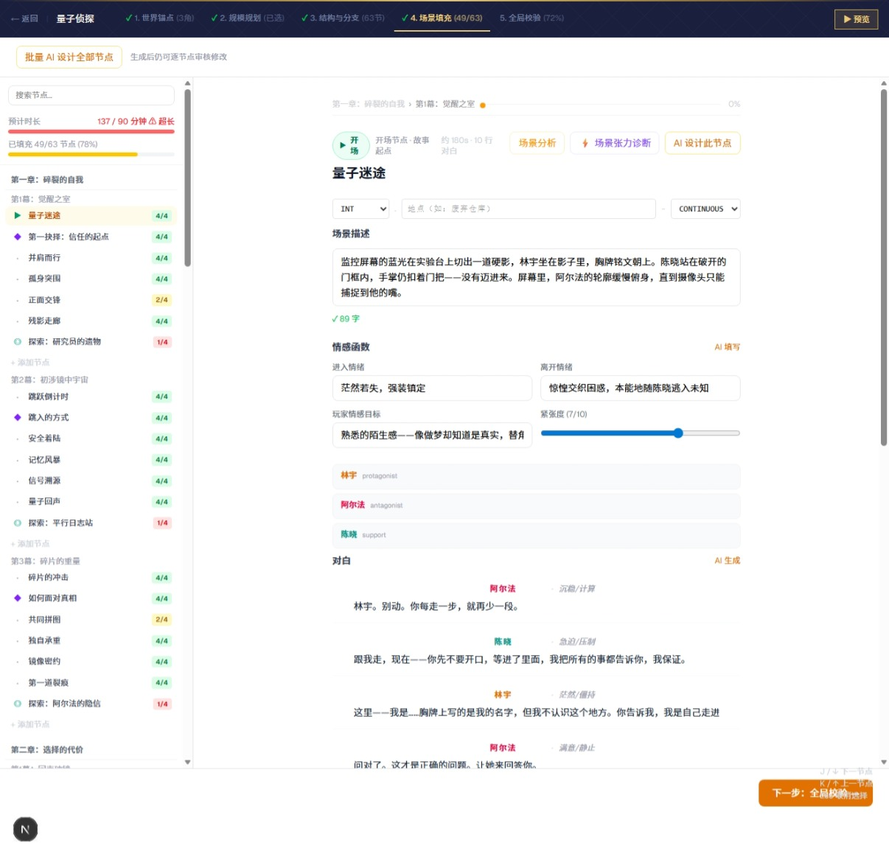
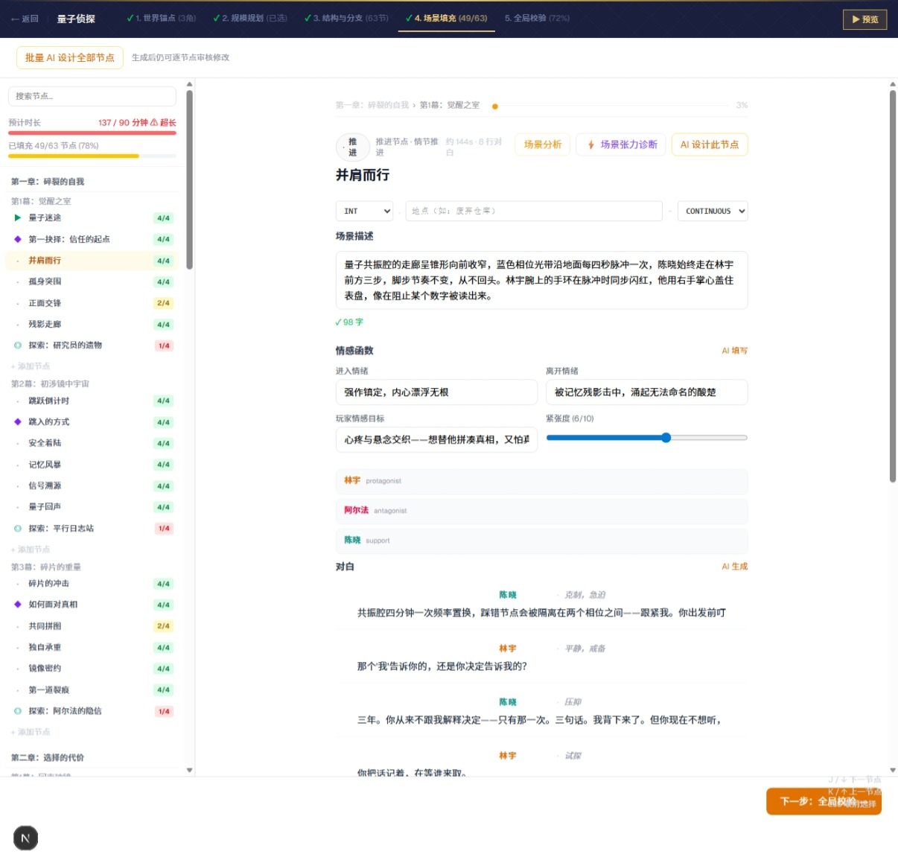
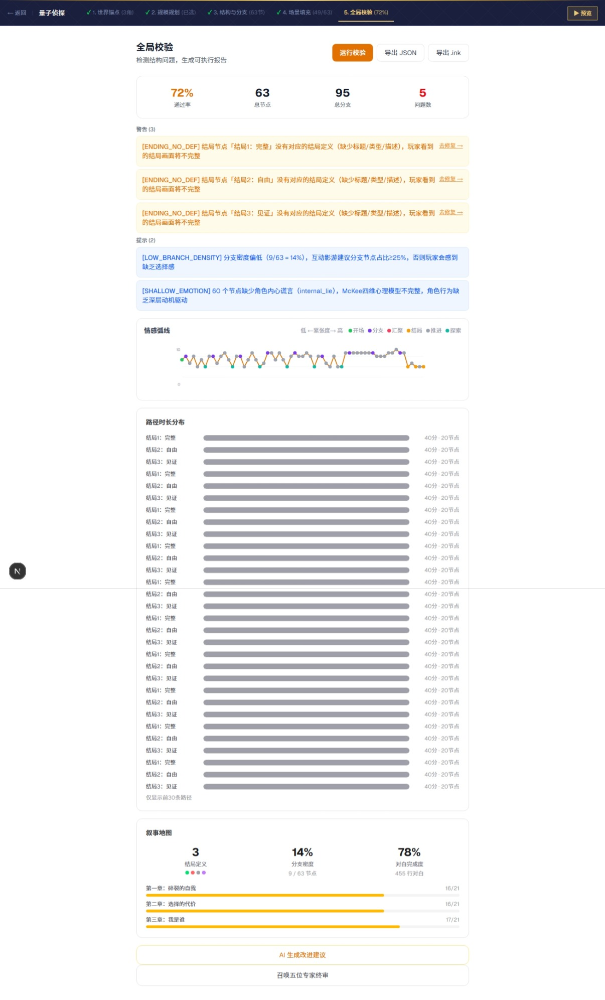
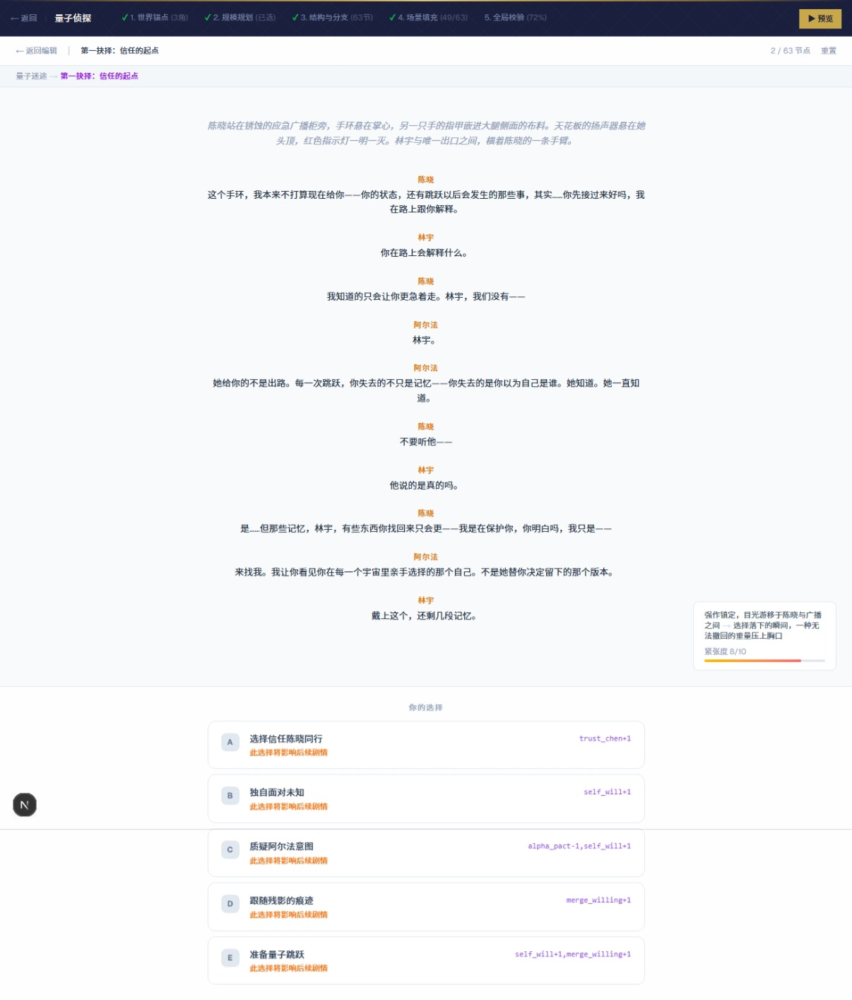

# Interactive Film Game Studio

[中文](README.md) · English

> From a single story premise to a fully deliverable interactive film game script — AI collaborates throughout, while the writer stays in creative control.

       



---

## What is this?

An AI-assisted authoring tool for screenwriters and interactive narrative designers. It breaks the creation process into **5 structured phases**, providing AI collaboration at each stage while keeping the writer in full creative control.

---

## 5-Phase Workflow

### Phase 1 · World Anchor

Define the story core, themes, world rules, and main characters. AI can review consistency, suggest characters, and propose ending directions in one click.



---

### Phase 2 · Scale Planning

Choose your project scope — Compact / Standard / Epic. AI generates three complete plans with estimated work hours; confirm and move to structure design.



---

### Phase 3 · Structure & Branches

**List view**: Manage all narrative nodes in a Chapter → Act → Node hierarchy. Add, reorder, and set node types (Opening / Branch / Progression / Explore / Ending). When AI generates the narrative spine, progress streams in live — spine complete, then chapter N of M as each chapter is drafted.



**Flow view**: A visual narrative map powered by @xyflow/react — auto-layout, hover-to-highlight paths, free drag-and-drop. Manually repositioned nodes persist, so your layout survives a page reload.



---

### Phase 4 · Scene Workshop

Fill in scene descriptions, emotion arcs, and dialogue node by node. The left panel shows global progress; the right workspace lets AI write dialogue, fill emotion functions, and suggest choice branches in one click. A voice-profile card captures each character's speaking rhythm, vocabulary, and defense mechanisms under pressure so their dialogue stays consistent; a single node's dialogue can be revised with a one-line instruction; and bulk AI passes can be scoped to all nodes, the current chapter, or the current act, with an estimated-time readout and a retry list for anything that fails.





---

### Phase 5 · Global Validation

Automatically detects 10 categories of structural issues (orphan nodes, disconnected endings, shallow emotion arcs, broken variable references, trap branches, etc.). Generates emotion curves, path-length distribution charts, and a narrative map. Supports JSON / ink export. A one-click "director panel" review runs the script past five expert-director personas, each scoring it, flagging must-fix issues, and calling out the standout moment.



---

### Live Preview

Click "Preview" at any phase to play through the full interactive story — with variable tracking, emotion panels, and history breadcrumbs — without leaving the authoring environment. Clicking "Go back" correctly rolls variable state back to the snapshot before that step, so no already-applied choice effects linger.



---

## Getting Started

### Requirements

- Node.js 24+ (scripts under `scripts/` run as native TypeScript, no build step needed)
- Docker (for a local Postgres 17 instance; a managed database works too — see below)
- [Claude CLI](https://claude.ai/download) — optional, only needed if you pick the "Claude CLI" local-mode AI provider (logged in, `claude` command available)

### Install & Run

```bash
git clone https://github.com/mmlong818/filmgame.git
cd filmgame
pnpm install                # or npm install

cp .env.local.example .env.local
# Edit .env.local: set a login password in APP_PASSWORD;
# generate a distinct 32-byte hex value for each of AUTH_SECRET and ENCRYPTION_KEY:
# node -e "console.log(require('crypto').randomBytes(32).toString('hex'))"

pnpm db:up                  # start the local Postgres 17 container
pnpm db:migrate             # create the schema
pnpm db:seed                # insert a demo project so there's something to open right away

pnpm dev
```

Open [http://localhost:3000](http://localhost:3000), log in with `APP_PASSWORD`, and start from the Projects screen — open the demo project, pick a template, or create a blank project.

No Docker, want to swap in a managed database (Neon), or need production deployment steps (Vercel / VPS)? See [docs/db-setup.md](docs/db-setup.md) (Chinese only, for now).

---

## Auth & Data Reliability

- **Single-password login**: built for self-hosted, single-user deployments — the login screen just asks for the `APP_PASSWORD` configured in `.env.local`, no account system required; sessions are stored as a signed cookie.
- **Postgres as the single source of truth**: project data no longer lives in localStorage or local JSON files — the browser cache is only used for optimistic UI painting and offline fallback.
- **Autosave**: saves are scoped down to the individual node level, writes use optimistic locking (a version check), and editing the same project in multiple tabs surfaces a version-conflict prompt; writes made while offline are queued locally and replayed automatically once the connection returns; and any unsaved changes are flushed automatically before the page closes.
- **Encrypted API keys**: BYOK API keys are encrypted with AES-256-GCM before being stored, never in plaintext.

---

## AI Integration

### Dual AI Modes

Every project can toggle between two AI generation modes from the top bar at any time — subsequent AI actions run in whichever mode is active:

| Mode | Description |
|------|-------------|
| ⚡ **Fast** | A lighter model with deep reasoning turned off — good for quickly blocking out a skeleton |
| 🧠 **Thinking** (default) | Deep reasoning, quality-first, roughly 1-10 minutes per generation |

A typical flow: block out the skeleton in Fast mode, then switch to Thinking mode for a quality pass. The model used by each mode can be set independently in Settings (leave blank to fall back to the provider's default).

### AI Providers

Multiple AI providers are supported and can be switched in the Settings panel:

| Mode | Description |
|------|-------------|
| **Claude CLI** (default) | No API key needed — uses your logged-in Claude subscription via `claude --print`; local-mode only (`DEPLOY_MODE=local`) — disabled when `DEPLOY_MODE=deploy` |
| **Anthropic API** | Direct API access with your API key |
| **OpenAI API** | GPT-series models with your API key |
| **Google Gemini API** | Gemini-series models with your API key |
| **Custom Endpoint** | Any OpenAI-compatible API (local models, proxies, etc.) |

Supported AI phases and actions (19 in total, defined in `lib/ai/schemas.ts`'s `SCHEMA_REGISTRY`):

| Phase | Action | Description |
|-------|--------|-------------|
| `world` | `review`, `fix_issues`, `suggest_characters`, `suggest_variables`, `endings_design` | World-building |
| `scale` | `generate` | Scale plan generation |
| `structure` | `spine`, `chapter` | Narrative spine and chapter structure |
| `branches` | `generate` | Branch topology |
| `workshop` | `fill_emotion`, `write_dialogue`, `revise_dialogue`, `suggest_choices`, `scene_analysis`, `scene_tension`, `character_voice`, `choice_consequence` | Node content creation and refinement |
| `validate` | `report`, `director_review` | Global structural review, five-director panel review |

---

## Tech Stack

| Layer | Technology |
|-------|-----------|
| Framework | Next.js 16.2 (App Router) |
| UI | React 19 + Tailwind CSS v4 |
| State | Zustand v5 |
| Flow graph | @xyflow/react v12 |
| AI orchestration | LangChain / LangGraph, with optional LangSmith observability |
| AI providers | Claude CLI / Anthropic / OpenAI / Gemini / Custom |
| Database | PostgreSQL 17 + Drizzle ORM |
| Language | TypeScript 5 |

---

## Project Structure

```
filmgame/
├── app/
│   ├── api/auth/        # Login/logout (single password + signed session cookie)
│   ├── api/ai/          # AI gateway (LangChain/LangGraph dispatch across providers)
│   ├── api/projects/    # Project CRUD API (incl. a per-node save endpoint)
│   ├── api/settings/    # BYOK API key read/write (AES-256-GCM at rest)
│   └── project/[id]/    # 5 phase pages
│       ├── world/
│       ├── scale/
│       ├── structure/
│       ├── workshop/
│       └── validate/
├── lib/
│   ├── ai/              # LangChain provider adapters, prompt templates, schemas (SCHEMA_REGISTRY)
│   ├── db/              # Drizzle schema and repository layer
│   ├── server/          # Encryption, session signing, auth
│   ├── store/           # Zustand stores
│   ├── types/           # TypeScript types
│   ├── validation/      # 10-category BFS validation engine
│   └── persistence.ts   # Client-side autosave (optimistic locking + offline queue)
├── drizzle/             # Database migration SQL (generated by drizzle-kit)
├── docker-compose.yml   # Local Postgres 17 container
└── scripts/seed-db.mjs  # Demo project seed script
```

---

## License

Copyright © 2026 猫叔 ([mmlong818](https://github.com/mmlong818))

Source code is available for personal learning and non-commercial research. **Any use, modification, or redistribution must retain the original author attribution and this copyright notice.** Commercial use requires prior written authorization.

---

## Contributors

- [mmlong818](https://github.com/mmlong818) — Author & maintainer
